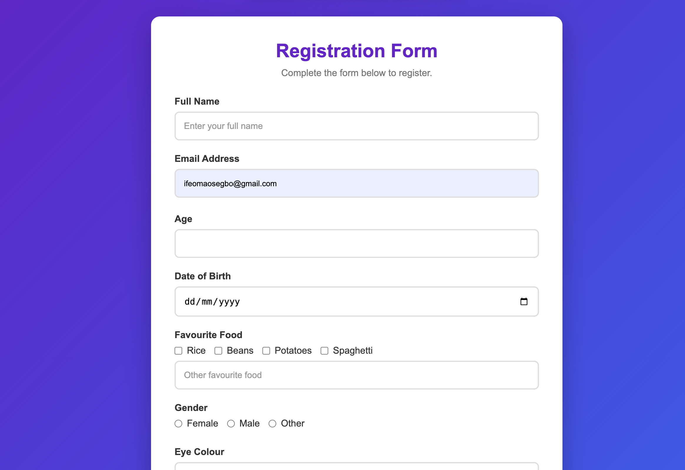

# Web Forms



## Overview

This project showcases my learning journey in building modern, responsive web forms using **HTML, CSS, and JavaScript**. It demonstrates how to create accessible forms, apply client-side validation, improve user experience with interactive feedback, and style forms with a clean, responsive layout.

---

## Features

- Modern and responsive user interface
- Semantic HTML5 form structure
- Client-side validation with JavaScript
- Real-time password matching
- Character counter for the bio section
- Required field validation
- Responsive design for desktop and mobile devices
- Form reset functionality
- Success message after submission

---

## Technologies Used

- HTML5
- CSS3
- JavaScript (ES6)

---

## Form Elements Included

- Text input
- Email input
- Number input
- Date picker
- Checkboxes
- Radio buttons
- Select dropdown
- Textarea
- File upload
- Telephone input
- URL input
- Color picker
- Password input
- Hidden input
- Submit and Reset buttons

---

## Learning Objectives

This project helped reinforce my understanding of:

- Semantic HTML structure
- Form accessibility using labels and input associations
- Different HTML input types and their use cases
- HTML validation attributes (`required`, `min`, `max`, `placeholder`, etc.)
- Responsive layouts using CSS Flexbox
- CSS styling and modern UI design
- DOM manipulation with JavaScript
- Client-side form validation
- Improving user experience through interactive feedback

---

## Project Structure

```
webforms/
│
├── index.html
├── styles.css
├── script.js
├── results.html
├── README.md
└── images/
    └── form-preview.png
```

---

## Future Improvements

- Store submitted data using Local Storage
- Dark mode toggle
- Custom validation messages
- Form submission with a backend (Node.js/Express)
- Database integration
- Email verification
- CAPTCHA support

---

## Author

**Ifeoma Osegbo**

This project is part of my front-end development learning journey as I continue building practical projects with HTML, CSS, JavaScript, and modern web technologies.# Web Forms


## Overview

This project showcases my learning journey in building modern, responsive web forms using **HTML, CSS, and JavaScript**. It demonstrates how to create accessible forms, apply client-side validation, improve user experience with interactive feedback, and style forms with a clean, responsive layout.

---

## Features

- Modern and responsive user interface
- Semantic HTML5 form structure
- Client-side validation with JavaScript
- Real-time password matching
- Character counter for the bio section
- Required field validation
- Responsive design for desktop and mobile devices
- Form reset functionality
- Success message after submission

---

## Technologies Used

- HTML5
- CSS3
- JavaScript (ES6)

---

## Form Elements Included

- Text input
- Email input
- Number input
- Date picker
- Checkboxes
- Radio buttons
- Select dropdown
- Textarea
- File upload
- Telephone input
- URL input
- Color picker
- Password input
- Hidden input
- Submit and Reset buttons

---

## Learning Objectives

This project helped reinforce my understanding of:

- Semantic HTML structure
- Form accessibility using labels and input associations
- Different HTML input types and their use cases
- HTML validation attributes (`required`, `min`, `max`, `placeholder`, etc.)
- Responsive layouts using CSS Flexbox
- CSS styling and modern UI design
- DOM manipulation with JavaScript
- Client-side form validation
- Improving user experience through interactive feedback

---

## Project Structure

```
webforms/
│
├── index.html
├── styles.css
├── script.js
├── results.html
├── README.md
└── images/
    └── form-preview.png
```

---

## Future Improvements

- Store submitted data using Local Storage
- Dark mode toggle
- Custom validation messages
- Form submission with a backend (Node.js/Express)
- Database integration
- Email verification
- CAPTCHA support

---

## Author

**Ifeoma Osegbo**

This project is part of my front-end development learning journey as I continue building practical projects with HTML, CSS, JavaScript, and modern web technologies.
